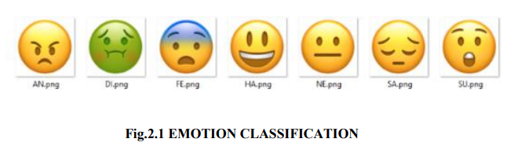

# Project Description 

<h2 align="center">( Major Project created in year 2021 )</h2>

<h1 align="center">Avatar Creator using Deep Learning </h1>
 <h2 align="center">College Major Project based on Deep Learning using Python</h2>

<h2 align="center">INTRODUCTION  TO  PROJECT </h2>

 Emoji or avatars are ways to indicate nonverbal cues. These cues have become an essential part of online chatting, product review, brand emotion, and many more. It also led to increasing data science research dedicated to emoji-driven storytelling. With advancements in computer vision and deep learning, it is now possible to detect human emotions from images. In this deep learning project, we aim to create human avatars and then classify them to filter and map corresponding emotions. The project consists of three modules which are first the facial recognition using CNN, then classifying by mapping the type of emotion the person is having and finally converting that expression to an Avatar/Emoji. To recognize facial emotional expressions, we use deep convolutional neural networks, where early experiments show an overall accuracy of 65% on the FER-2013 dataset which is the dataset we are going to use here. 
 The proposed project presented is simplified in three objectives as face detection, emotion classification, and avatar creation. With the flourish of social networks, an increasing number of people enjoy sharing their life and communicating with more graphical representations instead of pure text messages. The most popular and efficient graphical representations are emoji. 
 Nowadays, almost every person ranges from all age groups and occupations are frequently using emoji to add emotional elements to their chat, which helps others understand their feelings. Compared to pure literalness, emoji contribute to connect people together and promote relationships within friends, lovers, and families. Thus, it inspired us to make an application that can convert a person’s facial expression into his Avatar which will enhance the user experience of chatting and the study was backed by varying research papers.

 

<h2 align="center">LIBRARY SPECIFICATIONS </h2>
 i) Python = 3.7
 ii) numpy
 iii) Sklearn = 0.19.1
 iv) Random = 2
 v) String

<h2 align="center">PACKAGES </h2>
 import nltk
 import numpy
 import random
 import string
 from sklearn.feature_extraction.text import TfidfVectorizer

<h3 align="center">------ Modules used ------ </h3>
  To achieve our goals of building an avatar creator, we need to work mainly on three 
modules. They are explained one by one.

 <h2 align="center">1. Face Detection and Recognition </h2>
 Facial Detection and recognition research has been widely studied in recent years. Its applications play an important role in many areas such as security, camera surveillance, identity verification in modern electronic devices, criminal investigations, database management systems, and smart card applications, etc. First of all, we need to detect the face from images. An image is relatively large and contains some disturbance pixel data other than the face which is the only one we’re interested in. If we perform face detection first, it is able to reduce data size and make features of the face more manifest which helps to produce a better classifier. Without the interference of unnecessary pixel data, during the training process, it can quickly recognize features of each expression class. We will first download the dataset and make a simple CNN and train our model on the training dataset.

 <h2 align="center">2. Emotion Classification </h2>
 We are going to use a user's facial emotional expression to filter out the relevant set of emojis by emotion category. To validate our method, we crowdsourced 15,155 emoji to emotion labels across 308 website visitors and found that our 202 tested emojis can indeed be classified into seven basics (including Neutral) emotion categories. These are shown in the above picture. We are going to use OpenCV for emotion classification here by making a dictionary and mapping the face in the camera with that of one of the values of that dictionary. We will start by marking the person’s face in the camera by making a rectangle around it. After that, the model we trained above will be used to do face detection and recognition of the emotion and finally classify the type of emotion from the given list of emotions.

 <h2 align="center">3. Avatar Creation </h2>
 New technologies have made contemporary communication easier than ever. According to a recent Apptopia survey, today’s top four apps in terms of screen time are all social apps. In 2015, half of all Instagram comments included an emoji. By 8 2017 over 60 million emojis were being sent daily on Facebook, and over 5 billion on Messenger. Almost all of those were stock platform emojis. As the use of and dependence on social apps continues to grow, so have attempted to personalize the experience, and this has engendered a thriving emoji industry. 
 Stock emojis and emoticons designed by artists are fun but lack the personalization many are seeking in the expanding emoji marketplace. More and more social apps are now leveraging AI technologies such as machine learning, deep neural networks, and facial recognition to enable users to create highly-individualized emojis from selfies and photos. Thus we are going to take the coordinates of the person’s face and since we have classified the emotion as well we can map that to the emoji and make our own avatar based on the coordinates of that person’s facial expression.

 

  <h2 align="center">CONNECTED LAYERS </h2>
 

 <h2 align="center">Face Recognition </h2>
  Facial Detection and recognition research has been widely studied in recent years. Its applications play an important role in many areas such as security, camera surveillance, identity verification in modern electronic devices, criminal investigations, database management systems, and smart card applications, etc. First of all, we need to detect the face from images. An image is relatively large and contains some disturbance pixel data other than the face which is the only one we’re interested in. If we perform face detection first, it is able to reduce data size and make features of the face more manifest which helps to produce a better classifier. Without the interference of unnecessary pixel data, during the training process, it can quickly recognize features of each expression class. We will first download the dataset and make a simple CNN and train our model on the training dataset. 
 A facial recognition system is a technology capable of matching a human face from a digital image or a video frame against a database of faces, typically employed to authenticate users through ID verification services, works by pinpointing and measuring facial features from a given image. 
 While initially a form of computer application, facial recognition systems have seen wider uses in recent times on smartphones and in other forms of technology, such as robotics.

  

 <h2 align="center">Classification Of Emotions </h2>
  The advancements in the field of deep learning and emotion recognition has been increasing in the recent past. The work presents a model framework that understands the emotion depicted on the face and from the voice. The primary goal of this work 18 remains to improve human-computer cooperation. Hood frontal face images and various voice cuts are provided by the model system. From the Image database FER2013, 25838 samples were used for training and 90 samples of Amrita Emote database (ADB) for testing. The speech database consists of four different datasets, with a total of 20,000 examples. 3/4 of this information is used to prepare and 1/4 of the information used is for testing. Intermittent neural networks (RNNs) and traditional neural networks (CNNs) are nervous system-based projects that use speech and image management to control emotions: pleasure, sadness, anger, hatred, surprise, and fear.

  

 <h2 align="center">Deep Learning </h2>
  Deep learning (also known as deep structured learning) is part of a broader family of machine learning methods based on artificial neural networks with representation learning. Learning can be supervised, semi-supervised or unsupervised. 
 Deep-learning architectures such as deep neural networks, deep belief networks, graph neural networks, recurrent neural networks and convolutional neural networks have been applied to fields including computer vision, speech recognition, natural language processing, machine translation, bioinformatics, drug design, medical image analysis, material inspection and board game programs, where they have produced results comparable to and in some cases surpassing human expert performance.

 <h2 align="center">CNN Algorithm </h2>
  When it comes to Machine Learning, Artificial Neural Networks perform really well. Artificial Neural Networks are used in various classification task like image, audio, words. Different types of Neural Networks are used for different purposes, for example for predicting the sequence of words we use Recurrent Neural Networks more precisely an LSTM, similarly for image classification we use Convolution Neural Network. In this blog, we are going to build basic building block for CNN. 
 Before diving into the Convolution Neural Network, let us first revisit some concepts of Neural Network. In a regular Neural Network there are three types of layers:
  1. Input Layers: It’s the layer in which we give input to our model. The number of neurons in this layer is equal to total number of features in our data (number of pixels incase of an image). 
  2. Hidden Layer: The input from Input layer is then feed into the hidden layer. There can be many hidden layers depending upon our model and data size. Each hidden layers can have different numbers of neurons which are generally greater than the number of features. The output from each layer is computed by matrix multiplication of output of the previous layer with learnable weights of that layer and then by addition of learnable biases followed by activation function which makes the network nonlinear. 
  3. Output Layer: The output from the hidden layer is then fed into a logistic function like sigmoid or softmax which converts the output of each class into probability score of each class.The data is then fed into the model and output from each layer is obtained this step is called feedforward, we then calculate the error using an error function, some common error functions are cross entropy, square loss error etc. After that, we backpropagate into the model by calculating the derivatives. This step is called Backpropagation which basically is used to minimize the loss.

 

 <h2 align="center">HAAR Cascade Classifier </h2>
  Haar Cascade classifiers are an effective way for object detection. This method was proposed by Paul Viola and Michael Jones in their paper Rapid Object Detection using a Boosted Cascade of Simple Features .Haar Cascade is a machine learning based approach where a lot of positive and negative images are used to train the classifier. 
 Positive Images – These images contain the images which we want our classifier to identify. 
 Negative Images – Images of everything else, which do not contain the object we want to detect. 
  Object Detection using Haar feature-based cascade classifiers is an effective object detection method proposed by Paul Viola and Michael Jones in their paper, "Rapid Object Detection using a Boosted Cascade of Simple Features" in 2001. It is a machine learning based approach where a cascade function is trained from a lot of positive and negative images. It is then used to detect objects in other images. 
 Here we will work with face detection. Initially, the algorithm needs a lot of positive images (images of faces) and negative images (images without faces) to train the classifier. Then we need to extract features from it. For this, Haar features shown in the below image are used. They are just like our convolutional kernel. Each feature is a single value obtained by subtracting sum of pixels under the white rectangle from sum of pixels under the black rectangle.

 

 <h2 align="center">TKinter for User Interface (UI) </h2>
  Python offers multiple options for developing GUI (Graphical User Interface). Out of all the GUI methods, tkinter is the most commonly used method. It is a standard Python interface to the Tk GUI toolkit shipped with Python. Python with tkinter is the fastest and easiest way to create the GUI applications. Creating a GUI using tkinter is an easy task. Tkinter is the standard GUI library for Python. Python when combined with Tkinter provides a fast and easy way to create GUI applications. Tkinter provides a powerful object-oriented interface to the Tk GUI toolkit.

 

<h2 align="center">PROJECT OUTPUTS </h2>
  Actual Results performed on actual person :
 
<!-- Project Outputs -->

 

 

 

 

 

 <h2 align="center">CONCLUSION </h2>
  Artificial Intelligence may be used to handle interesting tasks like emotion identification, yet this work is made considerably more difficult when a large number of photographs are employed. We humans, like our programme, make mistakes when it comes to understanding someone's sentiment. The highest level of accuracy was about 83 percent. Using Python 2.7, OpenCV & (CK and CK+) Database we were able to distinguish several sorts of human emotions in the current project.

 

 <h1 align="center">------------------------- END ------------------------ </h1>